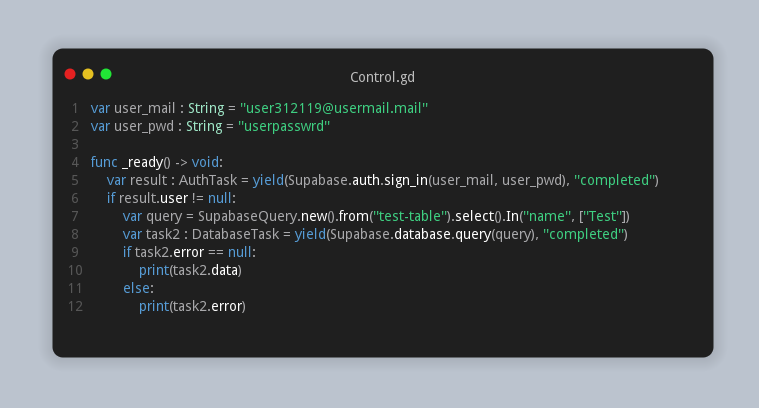

# Godot Engine - Supabase
A lightweight addon which integrates Supabase APIs for Godot Engine out of the box.  

- [x] GoTrue (/auth)
- [x] PostgREST (/rest)
- [x] Realtime (/realtime)
- [ ] Storage (/storage)

### examples and demos
A collection of examples and live demos is available at [*fenix-hub/godot-engine.supabase-examples*](https://github.com/fenix-hub/godot-engine.supabase-examples), both with source code and exported binaries.  

### how to use
A wiki is available [*here*](https://github.com/fenix-hub/godot-engine.supabase/wiki).  
Even though it is still not complete, Classes and APIs references are always listed and updated.  

### code snippet
Multiple approaches!

Javascript library style

GDscript style

