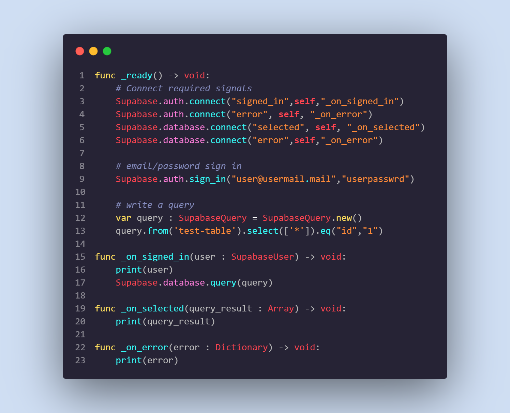

<p align="center"></p>

# Godot Engine - Supabase
A lightweight addon which integrates Supabase REST APIs for Godot Engine out of the box.  

### example


```
func _ready() -> void:
	# Connect required signals
	Supabase.auth.connect("signed_in",self,"_on_signed_in")
	Supabase.auth.connect("error", self, "_on_error")
	Supabase.database.connect("selected", self, "_on_selected")
	Supabase.database.connect("error",self,"_on_error")

	# email/password sign in
	Supabase.auth.sign_in("user@usermail.mail","userpasswrd")

	# write a query
	var query : SupabaseQuery = SupabaseQuery.new()
	query.from('test-table').select(['*']).eq("id","1")
	
func _on_signed_in(user : SupabaseUser) -> void:
	print(user)
	Supabase.database.query(query)

func _on_selected(query_result : Array) -> void: 
	print(query_result)

func _on_error(error : Dictionary) -> void: 
	print(error)
```
